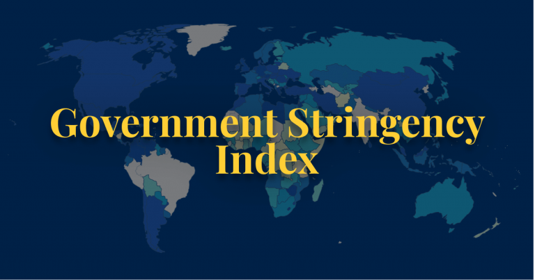

```{r setup, include=FALSE}
knitr::opts_chunk$set(echo = FALSE)

library(coronavirus)
library(dplyr)
library(gt)
library(tidyverse)
library(DT)
library(sparkline)
```


## Introduction

<div class="wrapper">
<div class="medium-7 columns" >
```{r, echo = F, out.width = '80%'}

```

</div>
<div class="medium-7 columns">

The current ongoing pandemic Coronavirus has affected millions of countries in various ways. To slow the spread of this virus, countries around the world are implementing strict measures, from national lock downs to school closures.
</div>
</div>
To calculate the intensity of these strict measures, the Oxford Coronavirus Government Response Tracker (OxCGRT) project came up with a **Stringency Index**. Stringency Index is a composite measure of nine of the response metrics.

The nine metrics used to calculate the Stringency Index are: restrictions on public gatherings; restrictions on internal movements; cancellation of public events; closures of public transport; stay-at-home requirements; school closures; international travel controls; workplace closures; and public information campaigns.

The index on any given day is calculated as the mean score of the nine metrics, each taking a value between 0 and 100. In this blog, we will be discussing about the covid' 19 Stringency Index in the Philippines. In the first part of the blog, we will have a look at the total number of confirmed cases, deaths, recovered and total number of vaccinated people so far in Philippines and in the latte part we shall look at the strictness of government policies with respect to the cases. 


```{r}

# Data Cleaning 
library(tidyverse)
covid_data <- read_csv("../../covid-data.csv")
 Philippines <- subset(covid_data, location=='Philippines')%>%
   select(date, total_cases, total_deaths, new_cases, new_deaths, new_vaccinations, total_vaccinations, new_tests, total_tests)
 
 # second data set recovered cases
 
 data("coronavirus")
 philippines <- subset(coronavirus, country=='Philippines')%>%
pivot_wider(names_from = type, values_from = cases)%>%
   select(date, recovered)
   
 table1 <-  merge(x = Philippines, y = philippines, by = "date", all.x = TRUE)
   
   
   table1$Year <- format( table1$date, format="%Y")
    table1$Month <- format( table1$date, format="%m")
    
 tab1<- table1 %>%  mutate(new_vaccinations = ifelse(is.na(new_vaccinations), 0, new_vaccinations),
           new_tests = ifelse(is.na(new_tests), 0, new_tests),
         recovered  = ifelse(is.na(recovered ), 0, recovered ),
         deaths = ifelse(is.na(new_deaths ), 0, new_deaths))%>%
    group_by(Year, Month)%>%
  summarise(Confirmed = sum(new_cases),
            Tested = sum(new_tests),
            Recovered = sum(recovered),
            Deaths = sum(new_deaths),
            Vaccinated = sum(new_vaccinations))
```

## Data Description

In this section we will be looking at the covid'19 statistics in Philippines along with its numerical summary statistics (mean, sd, max cases, min cases). In order to achieve this, I chose the data set from [ourworldindia](https://ourworldindata.org/) which contains information regarding the daily reported confirmed cases, total number of deaths, total vaccinated citizens, daily Stringency Index, etc. I filtered Philippines from the data set in order to get its day to day covid'19 statistics (@Philippines). The data set is updated on a regular basis and contains information till September 2021.

The only limitation of this data set is that it does not contain the recovery status of the citizen, hence to calculate that I used the [coronavirus](https://CRAN.R-project.org/package=coronavirus) package of R that provides a tidy format data set of the 2019 Novel @Coronavirus COVID-19 (2019-nCoV) epidemic. The raw data is pulled from the Johns Hopkins University Center for Systems Science and Engineering (JHU CCSE) Coronavirus repository.

## Numerical Summary Statistics 

### Covid'19 statistics

Philippines was ranked as one of the top countries in Southeast Asia and 27 out of the 192 countries based on the number of confirmed positive cases.
Lets have a look at the below table, table 1 which shows the total number of confirmed cases, tested positive, recovered, deaths and vaccinated people in Philippines. 

```{r}

gt(tab1) %>%
 tab_header(title = md("**Philippines**"),
 subtitle = "Table 1: Covid statistics of Philippines")%>%
 tab_source_note(md("Source: 2020 (JHU CCSE)"))%>% 
  tab_options(
    heading.subtitle.font.size = 12,
    heading.align = "center",
    table.border.top.color = "black",
    column_labels.border.bottom.color = "black",
    column_labels.border.bottom.width= px(3),
  )%>% 
  data_color(
    columns = (c(`Confirmed`, `Deaths`, `Recovered`, `Tested`)),
    colors = scales::col_numeric(
      c("white", "pink", "red"),
        domain = NULL
        )
      )

```

There were certainly more number of confirmed cases during the second wave of Covid'19 around April'21, due to which a sudden increase in the number of vaccinated people can be observed in May'2021. In 2020, the highest number of confirmed cases were recorded in August which resulted in almost 50% increase in the number of deaths from July. Based on this table, it can be assumed that the measures taken by the government might not be enough. We shall discuss more about the Stringency Index in the latter part of the blog.

### Summary Statistics

```{r}
Summary <- data.frame(
  Variables = c("Confirmed", "Tested", "Recovered", "Deaths", "Vaccinated"),
  Mean =  c(round(mean(tab1$Confirmed, na.rm = TRUE),2),
            round(mean(tab1$Tested, na.rm = TRUE),2),
            round(mean(tab1$Recovered, na.rm = TRUE),2),
            round(mean(tab1$Deaths, na.rm = TRUE),2),
            round(mean(tab1$Vaccinated, na.rm = TRUE),2)),

  SD = c(round(sd(tab1$Confirmed, na.rm = TRUE),2),
         round(sd(tab1$Tested, na.rm = TRUE),2),
         round(sd(tab1$Recovered, na.rm = TRUE),2),
         round(sd(tab1$Deaths, na.rm = TRUE),2),
         round(sd(tab1$Vaccinated, na.rm = TRUE),2)),

  Maximum = c(max(tab1$Confirmed, na.rm = TRUE),
            max(tab1$Tested, na.rm = TRUE),
            max(tab1$Recovered, na.rm = TRUE),
          max(tab1$Deaths, na.rm = TRUE),
            max(tab1$Vaccinated, na.rm = TRUE)),

  Minimum = c(min(tab1$Confirmed, na.rm = TRUE),
            min(tab1$Tested, na.rm = TRUE),
            min(tab1$Recovered, na.rm = TRUE),
          min(tab1$Deaths, na.rm = TRUE),
            min(tab1$Vaccinated, na.rm = TRUE))
  )
DT::datatable(Summary, options = list(pageLength = 5), caption = 'Table 2: Summary statistics of Cases in Phillipines')

```


The above table 2 shows that the max number of covid cases in Philippines were 365058. The standard deviation of the confirmed cases and vaccinations are higher indicating that the data in these columns are more spread out when compared to the death. It can be seen that the recovery rate is quite good as the mean recovered is quite high in comparison to the mean deaths. Its also satisfying to observe that the maximum vaccinaed number of people is 2849438	which shows that more and more number of people are getting them selves vaccinated. 

## Covid Stringency Index

As discussed above, the stringency index on any given day is calculated as the mean score of the nine metrics, each taking a value between 0 and 100. A higher score (i.e. 100 or close to 100) indicates a stricter response where as a low score indicates some ease in the policies and restrictions overall.

Lets have a close look on table 3 to understand the strictness of government policies with respect to the number of total confirmed cases. 

```{r}
 library(sparkline)
covid_data <- read_csv("../../covid-data.csv")
 subset(covid_data, location=='Philippines')%>%
 select(date, total_cases, stringency_index)%>%
   na.omit()%>%
group_by(stringency_index)%>%
  summarise(Cases = sum(total_cases),
    sparkline = spk_chr(total_cases, type = "line"))%>%
   arrange(Cases)%>%
  datatable(escape = FALSE,
            options = list(fnDrawCallback = htmlwidgets::JS('function(){HTMLWidgets.staticRender();}')), 
            caption =  'Table 3: Stringency index in the Philippines') %>% 
  spk_add_deps()
 
```

## Conclusion

According to the above analysis, we can see that with an ease in the restriction by the government, there was quite an increase in the number of cases. As the stringency index decreased from 100 to 96 and further to 77.78 in table 3, the number of cases recorded, started to increase from 173347 to 334494 and 363052 respectively. It can be concluded that Governance arrangements play a critical role in countries’ immediate responses to the spread of virus. 

Restrictions on internal movements; cancellation of public events; closures of public transport; stay-at-home requirements; school closures; international travel controls; workplace closures; and public information campaigns are few of the very important measures that Philippines or any other country should not ignore in order to avoid the COVID-19 transmission(@Stringency). 

Although these restrictions are curbing the spread of Coronavirus, they cannot last indefinitely, at least not without causing enormous damage to economies and compromising peoples’ good will and emotional well-being. Its important that people take precautions, get vaccinated and avoid going outside as much as they can. 

*Data sets used for the analysis are: @Philippines @Coronavirus*

*R packages used for the analysis are: @dplyr  @gt @tidyverse @sparkline @DT*
